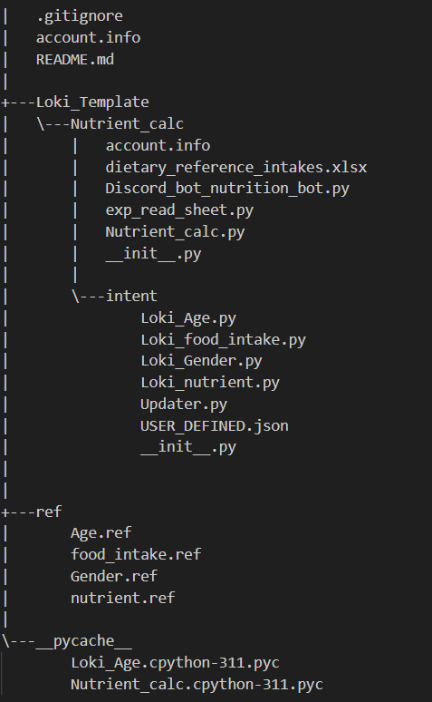

# 🥗 Nutrient Calculator Chatbot / 營養計算小幫手

## 📖 Overview / 簡介

Nutrient Calculator is an interactive chatbot that recommends daily nutrient intake based on your **age** and **gender**. It can provide guidance for key nutrients such as **calcium, vitamin C, iron**, and more, helping users maintain a balanced diet.  

營養計算小幫手是一款聊天機器人，能根據使用者的**年齡**與**性別**推薦每日所需營養素。它可以提供像是**鈣、維生素C、鐵**等主要營養素的建議，協助使用者維持均衡飲食。

---

## ⚙️ How to Use / 操作指南

1. Start by greeting the bot to initiate a conversation.  
2. Always **@Bot** before each message to ensure the chatbot responds.  
3. The bot will ask for your age and gender and then calculate recommended nutrient intake based on official guidelines.  

1. 與機器人打招呼開始對話。  
2. 每次發送訊息前請先 **@Bot**，確保機器人會回覆。  
3. 機器人會詢問您的年齡與性別，並依據官方建議計算每日營養素建議攝取量。

---

## 📊 Data Reference / 參考資料

The recommended nutrient intake is based on the official guidelines provided by the **Taiwan Health Promotion Administration**:  
[Daily Nutrient Reference Intake](https://www.hpa.gov.tw/EngPages/Index.aspx)

每日營養素建議攝取量依據 **衛生福利部國民健康署** 的官方資料：  
[國人膳食營養素參考攝取量](https://www.hpa.gov.tw/Pages/List.aspx?nodeid=4613)

---

## 🎬 Demo / 實際操作影片
- [Demo Video 實際操作影片](https://youtu.be/TabdABk-N-Q)

---

## 📂 Project Structure / 檔案總覽

---

## Contributors & Contact Info 聯絡資訊與貢獻
[Ellen](https://github.com/ellenyp) : ivickie621@gmail.com 
[Emily](https://github.com/emilyganpeijie) : ganpeijie3@gmail.com
